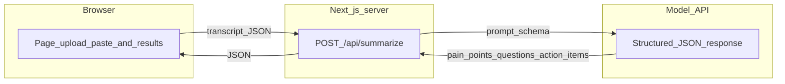

# Transcript summarizer

A small web app for **call transcripts**: you paste or upload text, and the app returns **customer pain points**, **questions the customer asked**, and **action items** (with **owner** when the transcript assigns one). Each item includes a **timestamp** when the transcript has time markers, so you can find the moment in the source text.

## How it works

1. **Input** — The browser sends the transcript text to a **server-side API route** (`POST /api/summarize`). Nothing sensitive to deployment should live in client-side code; the API key stays on the server (or in the host’s environment variables).

2. **Processing** — That route calls a **language model** with a fixed **structured output schema** (validated with Zod). The model fills three lists: pain points and questions as `{ text, speaker, timestamp }`, and action items as `{ task, owner, timestamp }` (`speaker` / timestamps are `null` when the transcript does not provide them).

3. **Output** — The API returns JSON; the page renders three sections (time, speaker where relevant, content) and can **copy results as Markdown**.



## Project layout

| Area | Role |
|------|------|
| `app/page.tsx` | Upload / paste UI, loading and errors, result sections |
| `app/api/summarize/route.ts` | Validates input, size limits, calls the model, returns JSON |
| `lib/transcript-schema.ts` | Zod schema and max transcript size constant |

Optional: **Vercel Web Analytics** is wired in `app/layout.tsx` (`@vercel/analytics`); enable it in the Vercel project dashboard.

## Local development

**Requirements:** Node.js 20.x (see `package.json` `engines`).

1. Install dependencies:

   ```bash
   npm install
   ```

2. Configure the server key (not committed to git):

   ```bash
   cp .env.example .env.local
   ```

   Set `OPENAI_API_KEY` in `.env.local`.

3. Run the dev server:

   ```bash
   npm run dev
   ```

   Open [http://localhost:3000](http://localhost:3000).

## Production

Deploy on **Vercel** (or any Node host): set `OPENAI_API_KEY` in the provider’s **environment variables** and redeploy. The API route uses a bounded execution time suitable for typical serverless limits; very long transcripts may need longer timeouts or a paid tier on the host.

## Scripts

| Command | Purpose |
|---------|---------|
| `npm run dev` | Development server (Turbopack) |
| `npm run build` | Production build |
| `npm run start` | Run production server locally |
| `npm run lint` | ESLint |
