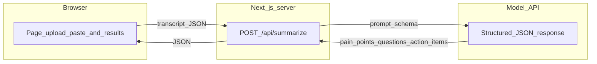

# Transcript summarizer

A small web app for **call transcripts**: you paste or upload text, and the app returns **customer pain points**, **questions the customer asked**, and **action items** (with **owner** when the transcript assigns one). Rows include **timestamps** when the transcript has time markers, and **speaker** labels for pain points and questions when names appear in the file—so you can find the moment in the source text.

## How it works

1. **Input** — The browser sends the transcript text to a **server-side API route** (`POST /api/summarize`).

2. **Processing** — That route calls a **language model** with a fixed **structured output schema** (validated with Zod). The model fills three lists: pain points and questions as `{ text, speaker, timestamp }`, and action items as `{ task, owner, timestamp }` (`speaker` / timestamps are `null` when the transcript does not provide them).

3. **Output** — The API returns JSON; the page renders three sections (time, speaker where relevant, content) and can **copy results as Markdown**.



## Model inference (API, query, response)

### Which API

Inference uses the **OpenAI Chat Completions API** via the official **`openai` JavaScript SDK** (`openai` npm package). The server calls **`chat.completions.parse`**, which requests a normal chat completion but **parses the assistant reply into a typed object** using **structured outputs**: the response must match a **JSON schema** generated from a **Zod** schema (`zodResponseFormat` from `openai/helpers/zod`). See [OpenAI Chat Completions](https://platform.openai.com/docs/api-reference/chat) and the SDK’s structured parsing helpers.

**Model:** `gpt-4o` · **temperature:** `0.2` · **Auth:** `OPENAI_API_KEY` on the server only.

### What gets sent (the “query”)

The completion is a two-message chat:

| Role | Content |
|------|--------|
| **system** | Instructions for analyzing **sales/support call transcripts**: extract only what is stated or strongly implied; rules for **timestamps** (copy transcript format or `null` if none exist); **speaker** for pain points and questions (from labels in the file, or `null`); **pain_points**, **customer_questions**, and **action_items** (task, owner, timestamp); do not hallucinate; prefer empty arrays and `null` over guessing. The full system prompt is in [`app/api/summarize/route.ts`](app/api/summarize/route.ts) as `SYSTEM_PROMPT`. |
| **user** | A single block: the prefix `Call transcript:` followed by two newlines and the **full transcript text** the client posted. |

So the only variable part of the inference request is the **raw transcript string**; everything else is fixed system instructions plus structured-output wiring.

### What comes back

The SDK returns a parsed object that matches [`lib/transcript-schema.ts`](lib/transcript-schema.ts). That object is what **`POST /api/summarize`** sends to the browser as JSON:

```json
{
  "pain_points": [
    { "text": "string", "speaker": "string | null", "timestamp": "string | null" }
  ],
  "customer_questions": [
    { "text": "string", "speaker": "string | null", "timestamp": "string | null" }
  ],
  "action_items": [
    { "task": "string", "owner": "string | null", "timestamp": "string | null" }
  ]
}
```

Arrays may be empty; nullable fields are `null` when the model cannot ground them in the transcript.

## Project layout

| Area | Role |
|------|------|
| `app/page.tsx` | Upload / paste UI, loading and errors, result sections |
| `app/api/summarize/route.ts` | Validates input, size limits, calls the model, returns JSON |
| `lib/transcript-schema.ts` | Zod schema and max transcript size constant |
